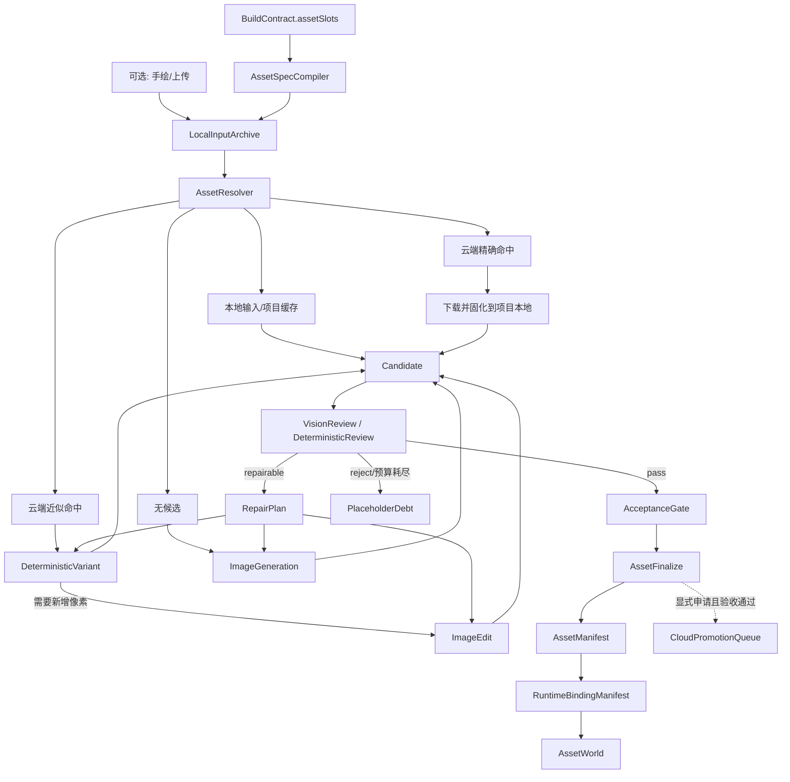

# GameCastle 资产引擎完整骨架

## 1. 目标与边界

资产引擎的目标不是生产最高画质，而是用最低交互和推理成本，把玩家的意象尽快变成可玩的项目资产。用户手绘或上传是可选入口，不是流程门槛。

本阶段只固定骨架：契约、词典、所有权、LangGraph 分图、端口、状态、存储边界、债务和测试门。像素算法、模型适配器、检索排序、提示词质量和具体 Runtime 注入由后续实现模型填充。

全局真相源是 `shared/asset-engine-contract.json`。它只引用而不复制两个专项真相源：

- `shared/asset-style-dictionary.json`：风格、色板、模板角色和动画策略。
- `shared/local-derivation-contract.json`：本地确定性操作、作用域和操作回执。

## 2. 唯一主链

关键修正：`AssetFinalize` 之后不能直接声称资产已进入游戏。只有生成并验证 `RuntimeBindingManifest`，且绑定目标是项目 Runtime 内的真实资源/对象后，状态才能从 `accepted` 进入 `bound`。

## 3. 六个 LangGraph 子图

| 子图 | 职责 | 结束条件 |
|---|---|---|
| AssetIntakeGraph | 把资产槽和可选用户输入编译为 AssetSpec，并归档原始输入 | AssetSpec 可验证 |
| AssetResolveGraph | 严格执行本地优先、云端复用、派生优先的决策阶梯 | ResolutionDecision 唯一 |
| AssetDeriveGraph | 调度本地确定性脚本或经授权的模型端口 | 产生带回执的 AssetRevision |
| AssetReviewGraph | 审查、修复循环、预算控制和验收 | accepted 或显式 debt |
| AssetFinalizeGraph | 固化记录、Manifest、Runtime Binding 和 AssetWorld | 世界投影完成 |
| CloudPromotionGraph | 独立处理显式云端晋升 | promoted 或 rejected |

子图之间只传契约产物，不共享隐式可变状态。LangGraph checkpoint 只保存 ID、决策和回执；大二进制文件始终留在对应存储域。

运行时入口是 `ai/asset-engine-langgraph.js`：它运行总图的 Intake、可选本地输入归档、Resolve、Finalize 和显式 Promotion 节点；Resolve 节点嵌套调用 `ai/asset-weave-graph.js`，后者承载 local/cloud 路由、确定性变体、模型端口、审查和修复循环。这样总图只编排阶段，像素与模型决策仍只有一份真相。

## 4. 解析阶梯

解析顺序不可由实现随意重排：

1. 用户本地输入（如果存在）。
2. 项目本地缓存。
3. 云资源库精确命中，下载后再使用。
4. 云资源库近似命中。
5. 本地确定性变体：裁切、缩放、改色、分帧、重排、描边、模板组合等。
6. 只有需要新增像素时才调用 ImageEdit。
7. 没有可用父资产时才调用 ImageGeneration。
8. 模型不可用、拒绝或预算耗尽时生成 PlaceholderDebt，不伪造成功。

解析的输出是 `ResolutionDecision`，不是图片。执行阶段必须根据决策产生新 revision 和 receipt。

## 5. 核心产物

| 产物 | 作用 | 不变量 |
|---|---|---|
| AssetSpec | 描述槽需要什么 | 包含 styleId 与 bindingTarget |
| ResolutionDecision | 说明为何走某条路线 | 一次只能有一个 nextStage |
| AssetRevision | 不可变的资产版本 | 有 hash、provenance、scope 和父版本 |
| OperationReceipt | 本地脚本执行证据 | 输入/输出 hash 均存在 |
| ReviewReceipt | 视觉或确定性审查结论 | 只能 pass/repairable/reject |
| AcceptanceReceipt | 对 AssetSpec 的最终验收 | 明确是否阻塞导出 |
| AssetManifest | 项目资产清单 | 只引用已固化 revision |
| RuntimeBindingManifest | 资产到游戏对象/资源槽的绑定 | 只允许项目本地路径 |
| AssetWorld | 供语义引擎和后续迭代读取的投影 | 每次 Runtime binding 保存后同步投影到 `output/asset-world.json`；可重建，不是写入主源 |
| AssetDebt | 未完成能力或资产的诚实出口 | 有 owner、恢复节点和导出影响 |

`styleId` 是资源词典的外键；`styleTags` 是检索标签，二者不可互相替代。候选资产的
`styleId` 与 AssetSpec 不一致时，验收门必须拒绝它。

所有修改都创建 revision；不能原地覆盖父资产。所有有像素变化的执行都创建 receipt。

Runtime 的 `asset-runtime-bindings.json` 中每个 binding 也必须携带 `revision` 与 `operationReceipt`：它们由 LocalAssetStore 在唯一持久化入口补齐，记录内容 hash、父 revision、项目本地路径、不可变标记和绑定操作证据。

## 6. 本地、云端与模型边界

### private-local

保存用户原始手绘和上传。默认禁止云读取和云写入。用户跳过手绘时，该域可以为空。

### project-local

保存项目实际使用的 PNG、帧、Manifest 和 Binding。Runtime 只能消费此域。云端精确命中也必须先 materialize 到这里。

### cloud-shared

只保存经过验收、有 provenance 和 license、且用户或策略显式申请晋升的资产。检索是读操作；命中不等于拥有，也不允许 Runtime 直接依赖远程 URL。

### ephemeral model transit

只有 `ModelPolicyGate` 能授权进入。请求必须带预算、数据范围、provider 身份和模拟标记。模拟端口永远不能标为真实 AI，也不能自动进入云库。

## 7. 端口与可替换实现

必需端口负责离线闭环：本地输入归档、项目缓存、云检索/下载、本地派生和 Runtime 绑定。模型端口与云晋升端口是可选能力；缺失时必须返回结构化债务。

每个端口的适配器不得改变领域契约。真实模型、模拟模型和确定性审查使用相同的输入输出外形，但 `provider`、`reviewer`、`simulation` 和成本字段必须如实记录。

`ModelPolicyGate` 是总 LangGraph 的独立节点。默认仅放行 `simulated-local`；外部 provider 需显式 `allowExternal`，否则不暴露 generate/edit/review 函数，嵌套 AssetWeave 将结果记为 `MODEL_UNAVAILABLE` 债务。它不保存密钥，也不替代具体 provider 适配器。

## 8. 状态机与恢复

资产状态只允许总契约声明的迁移。修复循环是 `reviewing -> repairing -> candidate`，不能绕过再次审查。`debt` 是本次解析的终点，但债务记录的 `recoveryStage` 可在能力补齐后启动新 revision。

实现状态和资产状态必须分开：

- `skeleton`：只有稳定插槽，无业务实现。
- `port`：只有外部适配契约。
- `partial`：已有部分实现，尚未通过完整门。
- `implemented`：模块存在；是否可交付仍由测试证据决定。

## 9. Runtime 与云库的硬边界

- DOM/iframe 覆盖层不属于 Runtime 绑定。
- 远程 URL 不属于项目资产。
- Manifest 记录不等于游戏对象已绑定。
- 绑定必须指向具体 Runtime 类型、资源名、对象/实例/状态槽，并生成可验证 manifestHash。
- 云端资源管理属于资产引擎，但 CloudPromotionGraph 与项目生成主链解耦，失败不能污染项目本地真相。

## 10. 后续实现顺序

P0：AssetIntake、可选 LocalInputArchive、AssetResolve（嵌套 AssetWeave）、AssetFinalize、RuntimeBinding、AssetWorld 与显式 CloudPromotion 已接入资产总 LangGraph；ModelPolicyGate 仍是下一步的 provider 授权实现。RuntimeAssetBinder 已完成首场景真实绑定：它把项目相对 PNG 路径保存为 resource `file`、生成稳定 resource `name`，并登记到 `layout.usedResources`，确保 GDevelop 在实例化 Sprite 前完成预加载。

P1：补齐 LocalDerivationKernel 注册的全部脚本与回执；建立批量 sheet 裁切、分帧、改色、模板组合和动画派生。

P2：实现云检索排序、下载缓存、license/provenance 验证与显式晋升后台。

P3：接入真实 ImageEdit/ImageGeneration/VisionReview，进行成本和 prompt 优化；模型永远是末端能力而不是主路径。

P4：资源词典和 UI/美术模板运营工具、版本迁移、指标和淘汰策略。
