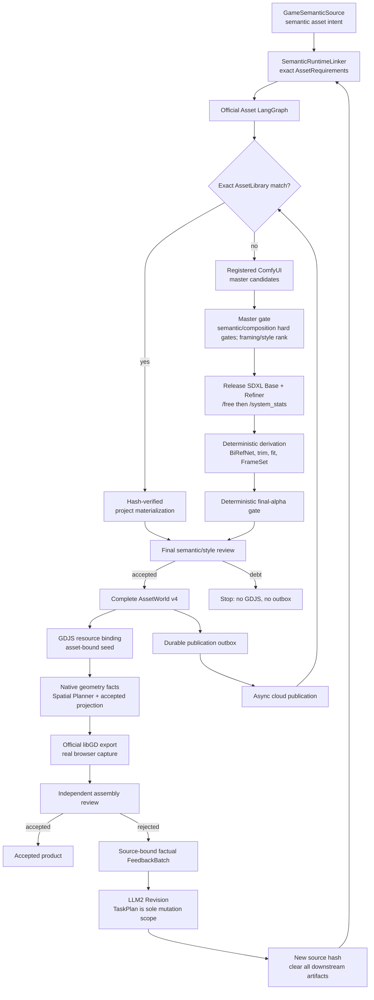

# Asset engine operations

## Runtime entry and boundary

`packages/product/src/product-delivery-orchestrator.js#run` is the product entry. It owns the persisted cross-stage run and invokes `packages/product/src/semantic-asset-product-pipeline.js#run` only as its asset stage. That stage validates the current Source, asks `semantic-runtime-linker.js` for one source-bound assembly, passes its exact `SemanticAssetRequirements` to `asset-engine-langgraph.js#runAssetEngine`, blocks on any asset debt, and resource-binds the complete accepted `AssetWorld` v4 to the project seed from the same source hash. No caller can submit a previous or partial AssetWorld.

```js
var productDelivery = require('./packages/product/src/product-delivery-orchestrator').create();
var product = await productDelivery.run({
  deliveryId: deliveryId,
  projectId: projectId,
  userRequest: userRequest,
  creativeVision: creativeVision
});
```

`POST /product/deliver` owns this complete path through `ProductDeliveryOrchestrator`. Its request accepts only product identity and creative input; storage paths, budgets, Asset execution policy, Spatial limits, and adapters are product-owned composition. After asset acceptance it derives native geometry, runs the official Spatial LangGraph to an accepted projection, exports that exact projection with official libGD, captures it through tokenized loopback HTTP in a real browser, signs the capture with the product-owned HMAC authority, and sends the immutable build/screenshot evidence to an independent assembly reviewer. A rejected assembly becomes exact-target factual FeedbackBatch input to LLM2. If LLM2 returns a source-bound Revision, the new source hash invalidates the AssetWorld, asset-bound seed, geometry, spatial artifacts, capture, review, and AssetCard projections before the orchestrator reruns every downstream stage.

`POST /semantic/execute` is only the strict deterministic Source/Revision compilation sub-boundary. It accepts no AssetWorld and never starts ComfyUI, writes assets, calls a model, performs spatial assembly, or claims product acceptance.



The `Final semantic/style review` node is implemented inside `AssetProductionPipeline` before `acceptedResult`. It reviews the actual runtime-size static PNG or every FrameSet frame. Rejection produces blocking debt, so `asset-finalize` emits no binding and `asset-publication-enqueue` emits no entry.

## Official LangGraph

The engine loads the official `@langchain/langgraph` package (currently `1.4.7`) and requires `Annotation.Root`, `StateGraph`, `START`, and `END`. The ordered graph and every stage's module exports are declared in `packages/assets/contracts/asset-engine-contract.json`. Startup calls `describeGraph()` and fails closed when a stage id, module, or export is missing; handler ids must also exactly match the contract. `tests/asset/check-asset-engine-langgraph.js` executes the compiled graph, while the definition-resolution probe below proves that every declared export is callable before a real provider run.

```text
START
  -> asset-intake
  -> local-input-archive
  -> asset-library-search
  -> model-authorize
  -> asset-production-plan
  -> asset-resolve
  -> asset-production
  -> asset-finalize
  -> asset-publication-enqueue
  -> END
```

```powershell
node -e "const c=require('./packages/assets/contracts/asset-engine-contract.json'); for(const [s,ds] of Object.entries(c.stageDefinitions)) for(const d of ds){const m=require('./'+d.module); for(const x of d.exports) if(typeof m[x]!=='function') throw new Error(s+' missing '+d.module+'#'+x)} console.log('all stageDefinitions resolve')"
```

| Stage | Definition owner | Materialized state |
| --- | --- | --- |
| `asset-intake` | `asset-engine-langgraph.js#compileSpecs`, `asset-engine-execution-policy.js#resolve` | execution policy, `assetSpecs`, `productionRequest` |
| `local-input-archive` | `asset-engine-langgraph.js#archiveLocalInputs` | immutable local-input records |
| `asset-library-search` | `asset-library.js#create` | exact library matches and acceleration events |
| `model-authorize` | `model-policy-gate.js#authorizeModelPorts`, `provider-runtime-adapters.js#createAssetProviderPorts` | authorized master-image ports and policy receipt |
| `asset-production-plan` | `asset-production-planner.js#compile` | pinned work items, recipe stages, coverage policy |
| `asset-resolve` | `asset-production-resolver.js#resolveProductionSet` | verified local/library candidates and resolution debts |
| `asset-production` | `asset-production-pipeline.js#runProductionSet` | accepted revisions, immutable receipts, blocking debts |
| `asset-finalize` | `asset-engine-langgraph.js#productionProjection`, `asset-world.js#buildAcceptedAssetWorld` | manifest, binding manifest, complete accepted AssetWorld v4, reports |
| `asset-publication-enqueue` | `asset-publication-outbox.js#create` | durable entries for new accepted revisions only |

The graph is deliberately linear; reuse versus creation is resolved as data inside `asset-resolve` and `asset-production`. This guarantees every run reaches the same finalization, debt reporting, and outbox gate instead of bypassing acceptance through a conditional edge.

## Image creation path

```text
exact AssetLibrary hit
  -> hash-verified project-local materialization

library miss
  -> official-core ComfyUI SDXL Base 80% -> Refiner 20% candidate batch
  -> master semantic/composition hard gates + structural/style ranking
  -> transient MasterImageRevision
  -> registered ComfyUI model-release barrier
  -> pinned BiRefNet removal when transparency is required
  -> deterministic trim / fit / anchor
  -> static PNG or FrameSetRevision
  -> deterministic final-alpha validation for every runtime image
  -> deterministic derivation receipt
  -> final-pixel CLIP semantic/style receipt
  -> accept or blocking debt
```

`packages/assets/src/comfyui-local-provider.js` owns the loopback ComfyUI protocol, the registered core-node workflow `gamecastle.master-image.sdxl-base-refiner.v1`, transient candidate storage, and CLIP review calls. The graph is derived from `comfyanonymous/ComfyUI_examples/sdxl`; model files, repository revisions, licenses, workflow bytes, and review model bytes are hash-pinned. It does not crop, remove backgrounds, resize, or animate.

`packages/assets/src/asset-derivation-pipeline.js` owns processing orchestration. `RembgBackgroundRemoval` owns opaque-background segmentation; `LocalDerivationKernel` owns deterministic PNG normalization, alpha trim, canvas fitting, anchors, and FrameSet transforms. Master images are transient, non-playable, and non-publishable.

### Phase-specific quality boundary

The master-candidate phase rejects undecodable/empty content and failed semantic or family-composition margins. Foreground coverage, connected components, centering, border deviation, and style margin are ranking signals, not hidden transparency requirements; a removable solid background is legal at this phase. Prompt composition is positive-first: exact subject, intended framing/background, family phrase, then concise Style DNA. The negative prompt contains only global high-value failures plus at most one family clause.

After the selected bytes are copied into project-scoped transit, ComfyUI must cross its registered `/free` resource barrier with `unload_models=true` and `free_memory=true`, then pass `/system_stats`. This prevents the SDXL Base/Refiner allocation from starving the CPU BiRefNet process. BiRefNet and deterministic derivation then produce the exact runtime pixels. The final phase validates alpha ratios and opaque perimeter deterministically, followed by semantic, style, and every required composition margin over the static PNG or each FrameSet frame. BiRefNet cannot repair a semantically wrong master, and CLIP cannot prove raw transparency by itself; both the deterministic alpha gate and final CLIP receipt are required.

Every failed candidate round is retained as metadata-only diagnostics with round and seed. Every failed production attempt is retained with its nested candidate-round diagnostics. Accepted ledgers retain prior failed attempts; debt ledgers retain the last exact rejection plus the complete attempt history. No image bytes are duplicated into diagnostics.

### Named execution profiles

Callers select `asset-engine-production.v1` or `asset-engine-test.v1`; they cannot pass loose `timeoutMs`, `batchSize`, `candidateRounds`, or `maxAttempts` through the AssetEngine API. The test profile is a general engine probe, not a snake rule: it refuses more than one generation-required work item before the first provider call and resolves to exactly one production attempt × one workflow submission × two candidates with a 180-second deadline propagated through Comfy requests, both CLIP phases, BiRefNet, and finalization. The registered workflow still owns the hard production ceiling; the profile owns the effective run budget.

Background removal uses the MIT-licensed `vendor/rembg` submodule pinned to tag `v2.0.75` and commit `7b8de60ef9fc225af1768d81aa09da29db22a355`. `birefnet-general-lite.onnx` is accepted only when its SHA-256 matches `packages/assets/contracts/background-removal-contract.json`.

```powershell
git submodule update --init --recursive
powershell -ExecutionPolicy Bypass -File scripts/assets/setup-rembg.ps1
```

The repository gate uses a checksum-verified deterministic test double for the
background-removal port so it can exercise the ComfyUI-to-derivation handoff
without downloading a model. It proves port wiring, receipts, alpha handling,
and hash rejection; it is not evidence that BiRefNet is installed or ran on
the current machine. A real local production run that needs opaque-background
removal must complete `setup-rembg.ps1` and retain the pinned runtime/model
files above.

## Acceptance and publication

- Exact cloud image matches must satisfy the complete requirement fingerprint including current Style DNA content and pass hash verification after materialization. A reusable receipt must bind the current work item, target visual slot, review-policy fingerprint, model revision/fingerprint, exact image hashes, and every required composition check; otherwise the materialized pixels are reviewed again or rejected.
- Image misses require one transient master-image batch followed by accepted derivation.
- Non-image resources require an explicit local artifact with matching resource kind, format, and SHA-256.
- `FrameSetRevision` owns animation states, ordered frames, timing, loop policy, canvas, and anchor. A sprite sheet is only a projection.
- Missing definitions, providers, files, hashes, formats, model budget, or coverage become blocking debt. There are no placeholders, compatibility readers, or silent retries.
- Product feedback is source-bound factual evidence only. Asset code cannot author Source mutations, `changeScope`, `maxRounds`, repair routes, or TaskPlan; LLM2 owns the next design decision.
- A structural prefilter pass is never authority to publish. Only a final-pixel semantic/style receipt can authorize image acceptance.
- Only newly accepted revisions enter the durable outbox. Library reuse never republishes the same revision.
- Outbox draining is asynchronous and owned by `asset-library-publisher.js`; the browser never receives storage service credentials.

## Verification

```powershell
npm run asset:graph
npm run check:asset-engine-execution
node tests/asset/check-asset-engine-langgraph.js
node tests/asset/check-semantic-asset-product-pipeline.js
node tests/asset/check-comfyui-local-provider.js
node tests/asset/check-rembg-background-removal.js
node tests/asset/check-asset-production-pipeline.js
node tests/asset/check-animated-asset-engine.js
npm run check:semantic-engine
npm run check:product-loop
npm run check:provider
npm run build
```

The local provider accepts `maxCost: Infinity` as an unlimited budget. This is required for zero-external-cost ComfyUI runs; converting it to zero causes `PROVIDER_BUDGET_EXHAUSTED` before the first provider attempt and is covered by `tests/provider/check-provider-runtime.js`.
