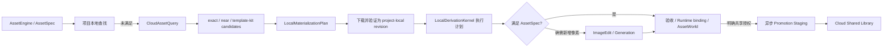

# GameCastle 云资产引擎

## 目标

云资产引擎是全用户共享的已批准游戏资源库。它的价值不是替本地 Runtime 处理图片，也不是
让 LLM 管理文件，而是提高资产引擎找到“直接可用、可本地派生、可按模板成套复用”资源的
概率，让玩家更快得到可玩的项目。

唯一结构契约是 `shared/cloud-asset-engine-contract.json`；云端受控词汇、视觉语法和模板定义分别由
`cloud-asset-dictionary.json`、`asset-style-dictionary.json` 与 `asset-template-dictionary.json` 拥有。
具体优先级见 `docs/cloud-asset-truth-sources.md`。本设计不兼容旧云库 schema，不保留旧字段别名、
双写、旧查询接口或旧状态映射。

## 与资产引擎的协作

资产引擎拥有当前项目、执行优先级、本地工具、模型调用、验收、Runtime 与 AssetWorld。云资产
引擎拥有公共候选、资源族、模板关系、不可变共享 revision、晋升和公共索引。云端只推荐，
资产引擎重新验证并执行。

## 轻量资源关系图

关系图只解决复用所需的多对多关系，不建设通用知识图谱平台。

| 节点 | 含义 |
| --- | --- |
| AssetFamily | 同一角色、道具、背景或声音的可替换资源族 |
| AssetRevision | 指向一个不可变 Blob 的具体版本 |
| StyleProfile | 引用资源词典中的 styleId |
| Template | 游戏模板或 UI 模板及其版本 |
| TemplateSlot | hero、enemy、background、HUD button 等槽位 |
| AssetBundle | 可成套复用的资源包 |
| licensePolicyId 引用 | 指向云资产词典中的公共复用和署名策略；不在关系图中复制策略 |

关系仅包括 `variantOf`、`derivedFrom`、`belongsTo`、`fillsSlot`、`usesStyle`、`contains` 和
`usedTogether`。查询不返回整图，只返回少量候选、匹配原因和可由本地 Runtime 执行的计划。

Template/TemplateSlot 是模板词典的带版本投影，CloudAssetEngine 不创建模板定义。图节点的
TemplateSlot 使用 `templateId::assetSlotId` 作为唯一 ID；业务槽位名仍保留为
`assetSlotId`。同名 `hero` 或 `asset.ui.custom` 可以安全地属于多个模板，不会串关系。

## 查询结果

`CloudCandidate` 必须包含 revision、匹配类型、风格、授权、质量与 `LocalMaterializationPlan`。
计划中的 operation 只能来自 `local-derivation-contract.json`。若计划能满足 AssetSpec，必须标记
`requiresNewPixels=false`；资产引擎不得调用模型。

`CloudLocalPlanRunner` 在项目本地解码 materialized PNG、逐项执行这些 operation、写出新的
project-local revision 与 operation receipt。计划无法满足或声明 `requiresNewPixels=true` 时，才把
控制权交还 AssetEngine 的 ImageEdit/Generation 分支。

查询排序优先级：

1. hash、资源族、模板槽与 styleId 均满足的 exact。
2. 可通过本地裁切、改色、缩放、分帧、锚点或模板装配满足的 near。
3. 能一次填充多个模板槽的 template kit。
4. 无候选；由资产引擎决定 ImageEdit 或 Generation。

`template-kit` 只在调用方明确给出 `templateContext.templateId` 和多个 `requiredSlots` 时触发。
调用方可用 `templateContext.slotSpecs` 为每个槽提供不同的语义约束；返回的 `TemplateKitCandidate`
按槽位列出候选，每个候选仍必须各自 materialize、本地验收并绑定。它不是把一个“套件”当作
未经验证的单一 Runtime 资产。

## 公共共享与晋升

正式云库是全用户共享的 `cloud-shared`。上传先进入不可公开的 `promotion-staging`，通过同意、
AcceptanceReceipt、Runtime binding、provenance、license、hash 去重和质量门后才能发布。

文件系统 cloud root 已移除，不能作为部署、fixture 或共享库真相。隔离测试只可注入进程内假端口。
部署 Runtime 必须注入 `CloudBlobStorePort`、`CloudRelationIndexPort`、`CloudPromotionQueuePort` 与
`CloudProjectionPort`；未注入时 `CloudAssetEngine` 会失败关闭。当前本地正式库的 bytes/hash 由 MinIO
保存，Revision/receipt 由 PostgreSQL 保存；项目运行时仍只绑定其 project-local materialization。

用户原始手绘、原始上传、private-local、测试和 simulated 资产永不进入云库。晋升异步执行，
失败不影响当前项目。相同 hash 已存在时只建立资源族、模板槽或使用关系，不重复上传 Blob。

## 存储

- BlobStore：不可变字节和媒体元数据。
- RelationIndex：资源族、revision、模板、槽、风格和轻量关系。
- ProjectionIndex：exact、near、template-kit 的可重建查询投影。
- PromotionQueue：异步状态、重试和回执。

这四个平面都通过 Port 注入 CloudAssetEngine，而不是被引擎核心直接假定为本地文件：

| Port | 最小方法 | 线上替换目标 |
| --- | --- | --- |
| CloudBlobStorePort | `put`、`get` | 对象存储或受控下载服务 |
| CloudRelationIndexPort | `load`、`save` | 关系/元数据数据库 |
| CloudPromotionQueuePort | `load`、`save` | 持久任务队列与 Worker |
| CloudProjectionPort | `rebuild` | 可重建的查询索引 |
| CloudAccessPolicyPort | `authorizeQuery`、`authorizeMaterialize`、`authorizePromotion` | 身份、租户、公开读取与晋升授权服务 |

默认适配器仅用于本地开发的共享目录。它证明同一契约可运行，但不等于线上部署。线上适配器必须
维持 Blob 的 sha256、不可变 revision、公开读取授权与相同的 project-local materialize 回执。

晋升状态会持久写入 `requested → validating → staged → enriching → approved → published` 的 receipt；
临时 BlobStore 故障按队列 retry policy 回到 `requested`，耗尽后才 `rejected`。候选 rights 由
license policy 推导，quality tier、quality flags 与 materialize 后的 usageCount 只参与 Projection
排序，不能篡改 RelationIndex 的 revision lineage。

Runtime 永远只使用 materialize 后的项目本地路径，不能把云 URL 写入 binding 或发布包。

## 通用性

契约支持 raster、sprite sheet、audio、font、UI template、game template 和 asset bundle；具体
媒体处理由本地 capability 决定。新增媒体类型应扩展 asset kind 与本地能力契约，不得修改
公共晋升、关系和物化语义。
