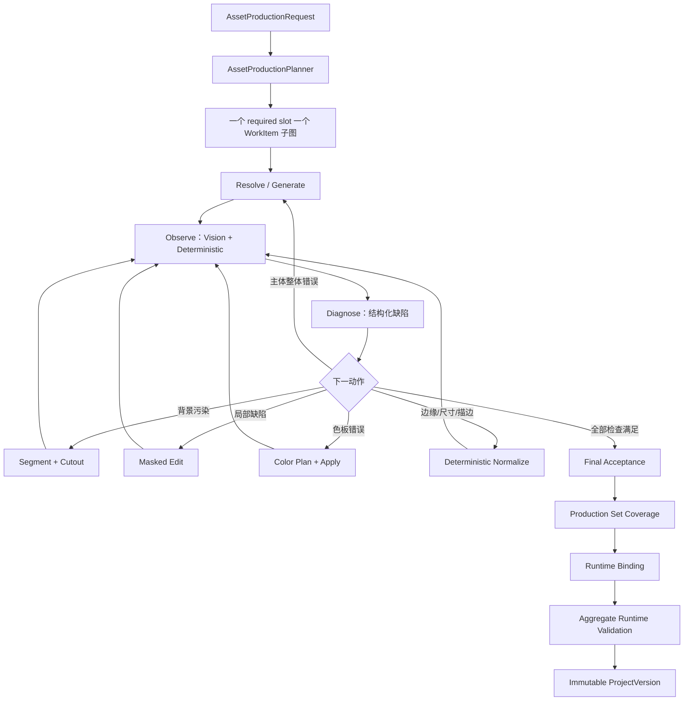

# ComfyUI 资产生产循环架构

## 1. 设计结论

GameCastle 的 ComfyUI 接入不是“一次调用生成一张图”，也不是“把角色、平台、道具和 UI 混画成一张大图”。它是由 Asset Engine 驱动的资产级闭环：

```text
规划 → 生成或复用 → 识图与确定性检查 → 缺陷诊断 → 选择一个动作
    → 抠图 / 局部改图 / 上色 / 归一化 → 重新识图与检查
    → 最终验收 → 全槽位聚合 → 真实绑定 → 完整可玩版本
```

上层机器真相源是 [`shared/asset-production-pipeline-contract.json`](../shared/asset-production-pipeline-contract.json)。本文只解释它，不复制 Style DNA、模板、Comfy workflow、像素操作、VisualSlot 或 ProjectVersion 的定义。

实现采用已有 `@langchain/langgraph` `StateGraph`。LangGraph 拥有循环状态、条件边、预算、checkpoint 和恢复；ComfyUI workflow 只执行一个受控像素或视觉任务；LangChain Agent 不进入资产主循环。

## 2. “完整后才能玩”的版本门

GameCastle 的迭代语义是：试玩一个已经完整的版本，提出修改，再构建下一个完整版本。它不是在运行中的游戏里热替换半成品资产。

新建或修改时：

1. 从模板与 Product Module 的 `VisualSlotDeclaration` 得到全部 required 视觉槽。
2. 每个 required 槽生成独立 `AssetWorkItemPlan`。
3. 每个工作项完成自己的资产循环并得到 accepted final revision。
4. `AssetProductionSetAcceptanceReceipt` 证明 required-slot coverage 为完整集合。
5. `RuntimeAssetBinder` 把每个 final revision 绑定到真实 `targetVisualSlotId`。
6. RuntimeValidator 完成浏览器、绑定、Viewport、Tick 和 replay 联合验证。
7. ProjectStore 才能原子提交新的 immutable `ProjectVersion`。

任一 required 资产失败或形成 debt，新版本不得提交。修改过程中可以继续打开上一个 immutable 可玩版本，但候选图、局部完成版本和临时 ComfyUI 输出都不能冒充可玩版本。

## 3. 唯一真相与责任边界

| 真相 | 唯一 Owner | 其他层只能做什么 |
| --- | --- | --- |
| 资产生产循环、阶段、状态、动作、预算和聚合门 | `shared/asset-production-pipeline-contract.json` / Asset Engine | ComfyUI 只接收单次动作投影 |
| 风格本质、Prompt 词元、色板角色、描边和阴影规则 | `shared/asset-style-dictionary.json` | Planner 引用 `styleId` 并编译，不复制文本 |
| 模板身份、版本、required slot、生产家族和 recipe 引用 | `shared/asset-template-dictionary.json` | 不定义模型、节点图或动态 Revision |
| Product Module 的真实游戏对象和视觉槽 | `VisualSlotDeclaration` | Asset Planner 只能引用 `targetVisualSlotId` |
| workflow 文件、模型、custom node、输入字段和部署限制 | `shared/comfyui-workflow-registry.json` | Asset Engine 只引用已批准 workflow ID |
| provider 授权、endpoint、预算、超时和安全回执 | ProviderRuntime 与 provider governance | Workflow 不决定是否允许调用 |
| PNG、Alpha、尺寸、裁切、边缘、锚点、图集组装等确定性事实 | `shared/local-derivation-contract.json` | Vision 不替代这些检查 |
| Revision、父链、hash、项目本地路径 | Asset Engine / LocalAssetStore | ComfyUI history 不是资产仓库 |
| 最终资产接受 | AssetAcceptanceGate | Vision 只提供事实证据 |
| 真实对象绑定 | RuntimeAssetBinder | Asset Engine 不能自行宣称已显示在游戏中 |
| 完整项目版本提交 | ProjectStore + RuntimeValidator | 单张 PNG 或 provider receipt 不能推进 active version |

任何字段如果在两个文件中分别定义，都视为设计错误。人类文档引用机器合同；代码不得维护另一份阶段枚举、Style Prompt 或 workflow allowlist。

## 4. LangGraph 结构



`AssetProductionLoopGraph` 是 `AssetEngineLangGraph` 的唯一资产生产子图。旧的混合异类父图主链和另一套 Comfy 内部领域循环必须删除。

### 4.1 Graph State

Graph checkpoint 只保存结构化小对象：

- `productionSetId`、`workItemPlanId`、`targetVisualSlotId`；
- 当前 `revisionId` 和 `maskRevisionId`；
- phase、attempt、预算、pending action；
- observation、action plan、execution receipt 的 ID；
- append-only history hash；
- accepted、rejected 或 debt 终态。

PNG、mask 和模型文件不进入 LangGraph state；它们保存在各自存储域，Graph 只持有不可变引用。

### 4.2 每轮循环

每轮必须严格执行：

1. `OBSERVE`：对当前 Revision 同时运行视觉事实检查和确定性像素检查。
2. `DIAGNOSE`：把问题编译成 typed defect，不能在此修改图片。
3. `PLAN`：只选择一个主要动作并预留次数、成本和时间预算。
4. `ACT`：调用 Comfy workflow 或 LocalDerivation operation。
5. `REVISE`：任何像素变化都产生新的 child Revision 和 execution receipt。
6. `REOBSERVE`：新像素使旧的视觉与确定性证据失效，必须重新检查。
7. `DECIDE`：满足全部 required checks 才进入 final review；否则继续、拒绝或产生 debt。

Comfy API 的网络重试与语义修复 attempt 分开计算。相同幂等任务没有产生新像素时，不应消耗一次修复预算；产生了不同像素，就必须产生新 Revision 并消耗预算。

## 5. 工序契约

### 5.1 生图 `image-generate`

输入：`workItemPlanId`、编译后的 Style Prompt、角色 Prompt、negative Prompt、尺寸、seed policy、批准的 workflow ID。

输出：`DraftAssetRevision + ProviderExecutionReceipt`。

规则：一次只生成一个主体或一个语义一致的同类场景。Draft 永远不是 binding-ready。角色、平台、道具、背景和 UI 禁止作为混合父图一次生成。

### 5.2 识图 `vision-review`

输入：当前 Revision、按生产家族编译的 inspection policy、批准的 workflow ID。

输出：`VisionInspectionReceipt`，包含主体数量、语义匹配、可见区域、bbox/mask 建议、背景、边缘、伪影和置信度。

规则：Florence 或其他视觉模型只陈述可观察事实，不输出最终 accepted。低置信度必须显式记录，不能用默认 pass 填充。

### 5.3 确定性检查 `local-derivation`

检查 PNG 解码、宽高、Alpha 范围、透明边缘、空白占比、边界触碰、trim、anchor、内容 hash、颜色数量和声明的 tile/frame 规则。

这些事实优先于模型判断。模型说“透明背景”但 Alpha 通道全不透明时，结果必须失败。

### 5.4 抠图 `subject-segment`

只有在出现背景污染、多主体分离或边缘需要 mask 时才进入。输入必须绑定 source Revision 和 inspection evidence；输出是版本化 `MaskRevision + SegmentationReceipt`。

mask 必须经过尺寸、范围、前景占比、边界连通性和主体覆盖检查。mask 不能藏在 workflow 内部，也不能被后续修复隐式替换。

### 5.5 改图 `image-edit`

输入：parent Revision、明确的 MaskRevision、typed defect、受限 repair Prompt、denoise policy、批准的 edit workflow。

输出：`RepairAssetRevision + ProviderExecutionReceipt`。

只修复声明区域。局部失败不应重新生成整个生产集；但主体、镜头或整体构图不可修复时，可以在 generation budget 内重新生成该工作项。

### 5.6 上色 `color-plan / color-apply`

上色不是每张图的必经模型步骤：

- 已有可靠区域 mask，且只需 palette role 映射时，使用 LocalDerivation 确定性换色。
- 需要产生新阴影像素或复杂区域过渡时，使用受控 image-edit workflow。
- `ColorPlan` 必须引用 Style DNA 的 palette role，并声明 protected regions、application mode 和 return stage。

上色结果是新的 `ColorAssetRevision`，随后必须重新识图和确定性检查。

### 5.7 风格归一化 `style-normalize`

只处理可以确定性表达的部分：透明边缘、尺寸、trim、anchor、粗描边、单层阴影、有限色族和轻量高光。它不能把完全错误的主体“包装成通过”。

### 5.8 最终验收 `final-review`

AssetAcceptanceGate 聚合 AssetSpec、视觉证据、确定性证据、Style DNA、provenance 和预算历史，输出 accepted、repairable、rejected 或 debt。只有 accepted final revision 才能参加生产集 coverage 和 Runtime binding。

## 6. 最短路径与条件能力

当前 GameCastle Style DNA 是粗描边、扁平色块、低细节几何形和轻量 toon 阴影，通常不需要重型流程全部执行。

默认最短路径：

```text
generate/reuse → vision inspect → deterministic validate → final review
```

按缺陷追加：

| 缺陷 | 下一能力 |
| --- | --- |
| 主体完全错误、镜头错误、不可修复构图 | 仅重生当前工作项 |
| 多主体或背景污染 | segment → mask validate → cutout |
| 局部形体、边缘或伪影错误 | masked edit |
| 色板角色错误 | color plan → deterministic recolor 或 masked edit |
| Alpha、尺寸、trim、anchor、描边或简单阴影错误 | deterministic normalize |
| 全部检查满足 | final review |

生产家族只改变检查表与可用能力，不产生另一套循环。Character、world geometry、prop、background、UI 和 effect 都运行同一个状态机。

## 7. ComfyUI 拓扑与 workflow 真相

P0 使用一个受治理的 ComfyUI endpoint 和多份版本化 workflow。生成、识图、分割和局部改图是不同 job，但不要求每个阶段启动一个操作系统进程。

多个 Comfy worker 仅是以后 GPU 扩容的部署决策；它不能改变 Graph state、Revision、receipt 或 acceptance 语义。

每份 workflow registry 记录：

- stable workflow ID、role、workflow 文件与 SHA-256；
- model ID、模型 hash 环境变量与 license；
- custom node 的 repository、固定 commit、包 hash、节点文件 hash、license 与 class allowlist；
- input fields、output node、最大尺寸、输出字节、timeout 和 private-local policy。

workflow 文件不能复制 Style DNA Prompt。运行时由 AssetProductionPlanner 根据 `styleId + productionFamily + AssetSpec` 编译本次 Prompt，再作为 typed input 注入。

Comfy queue、history 和 output 目录只属于 ephemeral execution。只有通过 Adapter 物化、hash、Revision 化和验收后的文件才能进入 `project-local`。

## 8. 成熟组件选型

P0 依赖政策：

- 原生 ComfyUI：必需，负责 workflow 执行和队列。
- 现有 Florence-2：保留，只作事实识图；不能承担 Acceptance。
- Impact Pack + Impact Subpack + SAM：分割、mask 和局部 detail repair 的首选候选；在固定 commit、文件 hash、节点 class、模型 hash 和 license 前保持未批准。
- LayerStyle：只作为可选离线组合工具，不进入 P0 主链。已验收同类帧需要打包时，优先使用现有 LocalDerivationKernel 的确定性 pack。
- 大型实验性 custom node 集：P0 不批准。

候选来源只用于审批前调研，不构成已安装或已批准事实：

| 候选 | 来源 | 目标能力 | 当前状态 |
| --- | --- | --- | --- |
| ComfyUI Impact Pack | <https://github.com/ltdrdata/ComfyUI-Impact-Pack> | detector、SAM mask、局部 detail repair | selected-unapproved |
| Impact Pack detector contract 参考 | <https://github.com/ComfyUI-extension-tutorials/blob/Main/ComfyUI-Impact-Pack/tutorial/detectors.md> | bbox、mask、crop、confidence 输出语义 | research-only |
| ComfyUI LayerStyle | <https://github.com/chflame163/ComfyUI_LayerStyle> | 可选离线层组合 | optional-unapproved |

只有审批完成后的固定 commit、package tree hash、入口文件 hash、node class allowlist、模型 hash 和 license 才能写入 `shared/comfyui-workflow-registry.json`。因此 registry 继续只记录当前已经批准的 workflow 与节点，不提前登记候选为可运行能力。

不因组件成熟就授予领域权力。GitHub custom node 只能实现一个 executor capability，不能决定资产语义、循环路由、接受、绑定或 ProjectVersion 提交。

## 9. 同类资产一致性与图集

一个生产集中的多个资产共享：`productionSetId + templateVersion + styleId`，但拥有独立 work item 和 Revision lineage。

角色动作或 UI 状态需要一致性时：

1. 先验收一个 master identity Revision。
2. 后续 pose/state 通过以 master 为 parent 的受控 image-edit 产生。
3. 每个子 Revision 独立检查与接受。
4. 所有源 Revision accepted 后，LocalDerivationKernel 可确定性 pack 成 Sprite Sheet。

图集是验收后的包装产物，不是让扩散模型一次画多个异类资产的生成捷径。

## 10. 失败、恢复与债务

| 失败 | Owner | 恢复 |
| --- | --- | --- |
| 模板 slot/family/recipe 不合法 | AssetTemplateDictionary | 修订模板版本 |
| 生产计划缺槽或目标映射 | AssetProductionPlanner | 重编计划，不调用模型 |
| workflow/model/node/hash 未批准 | ComfyWorkflowRegistry | 安装或批准后从动作前 checkpoint 恢复 |
| timeout、cancel、server restart、坏输出 | ComfyUIProviderAdapter | 幂等恢复或显式 provider debt |
| mask 无效 | VisionInspector + LocalDerivationKernel | 换 segmentation action 或形成 debt |
| 语义、风格或质量不合格 | AssetAcceptanceGate | typed repair action 或 reject |
| required slot 不完整 | AssetAcceptanceGate | 阻塞整个生产集与新版本 |
| 真实目标绑定失败 | RuntimeAssetBinder | 阻塞 RuntimeValidator 与版本提交 |

恢复必须从持久 checkpoint 和不可变 Revision 开始。不得从 Comfy history 猜状态，也不得因为服务重启重新消耗已经成功且有 receipt 的模型任务。

## 11. 当前事实与未完成项

已经存在：

- 官方 LangGraph 依赖与 Asset Engine 图入口；
- Comfy 本地 Adapter、固定 workflow registry、ProviderRuntime 预算与安全边界；
- SD 1.5 CPU generation smoke、Florence review smoke 和 image-edit/mask 基础链；
- LocalDerivationKernel、Revision、Acceptance、Runtime binding 和 ProjectVersion 基础设施；
- 唯一 GameCastle Style DNA。

尚未实现，因此保持 `designed`：

- 本合同的完整 `AssetProductionLoopGraph` 和 artifact validators；
- `subject-segment` 正式 workflow 与批准的 SAM/Impact Pack 依赖；
- typed defect → action planner → 每次像素变化后 reobserve；
- ColorPlan 与确定性/模型上色双路由；
- required production set coverage 对 ProjectVersion commit 的硬阻塞；
- 三个独立工作项共享 Style DNA、完整验收、真实绑定的 Golden 证据；
- GPU 质量、延迟、并发和 SLO。

CPU smoke 只证明协议与整体链条可执行，不能证明生产画质和速度。

## 12. Terra 实施顺序

1. 删除旧混合异类父图合同、实现、测试与 live smoke，不提供兼容 reader。
2. 为机器合同中的 request、plan、loop state、observation、action、mask、revision、attempt 和 acceptance receipt 建立 fail-closed validator。
3. 唯一 `AssetProductionLoopGraph` 已接入 LangGraph checkpoint；后续实现不得恢复旧修复循环。
4. 将 Comfy generate、Florence inspect、image edit 和 LocalDerivation 适配为原子 action executor。
5. 增加受批准的 segmentation workflow；在批准前相关 route 必须产生明确 debt。
6. 实现 typed defects、单动作规划、像素变化后强制 reobserve、预算和幂等恢复。
7. 实现生产集 required-slot coverage，并使 Runtime binding 和 ProjectVersion commit fail-closed。
8. 完成正常、失败、恢复、server restart、stale parent、坏 mask、预算耗尽和缺槽测试。
9. 用真实 ComfyUI 构建一个完整三槽项目；全部资产接受和真实绑定后，再执行真实浏览器 Golden。

Terra 的详细停止条件同步写入 [`docs/playable-runtime-terra-handoff.md`](playable-runtime-terra-handoff.md)。
