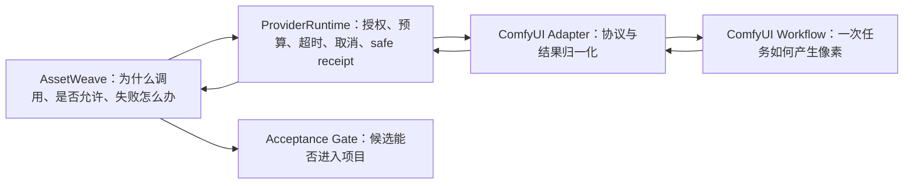
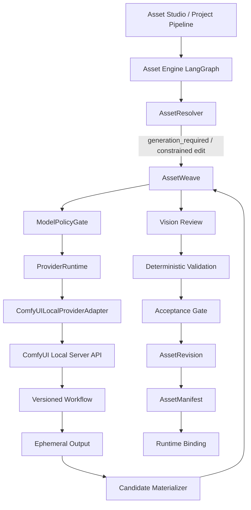

# GameCastle 本地 ComfyUI 资产 Provider 设计

## 1. 设计结论

GameCastle 接入 ComfyUI 时，ComfyUI 只作为 `ImageAgent`、`VisionAgent` 后面的本地模型执行器，
不成为资产引擎、资源解析器、资产仓库或 Runtime 的第二套真相源。

推荐生产技术栈：

| 职责 | 默认实现 | 选择理由 | 状态 |
| --- | --- | --- | --- |
| 工作流执行 | ComfyUI 本地 Server API | 工作流可版本化、异步排队、支持本地部署与多模型节点 | Stage A 已通过一次真实 CPU smoke；仅证明开发机闭环，不是生产能力 |
| 普通生图 | FLUX.1 Schnell FP8 | Apache 2.0、四步生成、速度优先，适合低成本游戏候选素材 | 目标设计，未验证 |
| 低显存与风格 LoRA 备选 | SDXL 1.0 | 生态成熟，适合风格 LoRA、ControlNet 与较小推理节点 | 受控 extension registry 已实现；当前开发机没有批准/安装 LoRA 或 ControlNet 权重 |
| 中文文字或复杂编辑 | Qwen-Image / Qwen-Image-Edit | Apache 2.0，中文文字和指令编辑能力强；模型重，不进入默认实时路径 | 可选目标，未验证 |
| 视觉事实卡与候选审查 | Florence-2-base | MIT、0.23B，适合 CPU/GPU 本地标签、描述、检测与轻量审查 | Stage B 已完成 CPU workflow/adapter smoke；不是生产质量证明 |
| 主体分割 | SAM 2 | Apache 2.0，适合主体 mask 和可解释分割 | 目标设计，未验证 |
| 快速透明背景 | rembg | 支持 CPU/GPU，适合背景明确的低成本批处理 | 目标设计，未验证 |
| PNG、尺寸、Alpha、哈希、锚点 | 现有 LocalDerivationKernel 与 validator | 确定性事实不能由概率模型裁决 | 已实现 |
| 最终接受、revision、binding | 现有 AssetWeave 与 Acceptance Gate | 保持资产 owner、预算、修复和发布边界 | 已实现 |

模型名称是可替换部署配置，不是领域真相。GameCastle 领域层只认识
`image-generate`、`image-edit`、`vision-review` 三个受控 role 及其 typed result。

## 2. 目标与非目标

### 2.1 目标

1. 在不改变资产解析优先级的前提下，补齐真实本地图像生成、图像编辑和视觉审查能力。
2. 在当前无 NVIDIA GPU 的开发机上完成一次真实像素最小闭环。
3. 将生产模型迁移到 16GB/24GB NVIDIA 推理节点时，不修改 AssetWeave、revision、manifest 或 binding。
4. 每次模型调用都受授权、预算、超时、取消、次数和 provenance 控制。
5. 用户私有图片默认不离开受控本地推理边界。

### 2.2 非目标

- 不让前端直接调用 ComfyUI。
- 不让 ComfyUI 决定是否需要生图、选择最终资产、批准发布或晋升云库。
- 不把 ComfyUI workflow、queue history 或输出目录当作 AssetRevision、ledger 或资产仓库。
- 不保证当前开发机的生成速度、并发或目标生产画质。
- 不在首个闭环中训练 LoRA、建设模型运营平台或同时接入所有候选模型。

## 3. 当前事实与目标设计

### 3.1 已由仓库证明的事实

| 事实 | Owner / 证据 |
| --- | --- |
| 解析顺序为本地、缓存、云精确、云近似、确定性派生、编辑、全新生成、placeholder | `ai/asset-weave-graph.js`、`docs/asset-engine-architecture.md` |
| `generate`、`edit`、`review` 是 fail-closed 端口 | `ai/asset-model-ports.js` |
| 编辑必须携带 `parentRevisionId` | `ai/asset-model-ports.js`、`ai/asset-weave-graph.js` |
| 模型候选必须经过 Vision、确定性校验与 Acceptance Gate | `ai/asset-weave-graph.js` |
| 候选必须为 PNG，尺寸与透明约束可确定性验证 | `ai/asset-contract-validator.js` |
| attempt、共享预算、幂等 ledger 与失败 debt 已存在 | `ai/asset-weave-graph.js` |
| ProviderRuntime 是唯一模型调用 owner | `ai/provider-runtime.js`、`docs/provider-runtime.md` |
| 模拟 provider 能证明控制流，但不能证明真实模型已上线 | `docs/resource-engine-completion-audit.md` |
| 当前开发机为 i7-14700、约 32GB RAM、Intel UHD 770，无 NVIDIA/CUDA | 2026-07-13 本机探测 |

### 3.2 尚未实现的目标

以下能力在完成代码、测试和 live smoke 前必须保持 `designed` 或 `partial`，不得写成已上线：

- ComfyUI server restart 的真实恢复 smoke；离线 timeout/cancel/output-missing 测试已存在。
- NVIDIA 节点上的质量、延迟、显存和并发基准。

## 4. 真相源与所有权

### 4.1 真相源层级

| 真相 | 唯一 Owner | ComfyUI 可见性 |
| --- | --- | --- |
| 资产流程、阶段、artifact、状态 | `shared/asset-engine-contract.json` | 只接收单次任务所需投影 |
| provider、endpoint 环境变量、授权、预算 | `shared/ai-provider-governance.json` | 不拥有、不修改 |
| role、超时、重试、receipt | `shared/provider-runtime-contract.json`、ProviderRuntime | 返回执行证据，不决定策略 |
| 风格、色板、锚点、动画策略 | `shared/asset-style-dictionary.json` | 只接收编译后的受限提示参数 |
| 本地确定性像素操作 | `shared/local-derivation-contract.json` | 不复制这些规则 |
| revision、父链、内容 hash | AssetRevision / LocalAssetStore | 只返回临时候选文件和执行元数据 |
| 最终接受或拒绝 | AssetAcceptanceGate | 无写权限 |
| Runtime 资产绑定 | RuntimeLinker | 无写权限 |
| Comfy 工作流内部节点图 | workflow registry | 不成为领域流程真相 |

### 4.2 两张图的边界



AssetWeave 与 ComfyUI workflow 不得合并：前者是领域状态机，后者是可替换的像素执行计划。

## 5. 接入架构



### 5.1 新增组件

#### `ComfyUILocalProviderAdapter`

只负责协议转换：

- 调用 ComfyUI health / queue；
- 上传允许的数据或引用受控本地输入；
- 将固定 workflow 模板参数化；
- 提交 prompt，监听或轮询任务；
- 处理 timeout、cancel、node error 和 server restart；
- 将输出复制到 provider 临时目录；
- 返回 typed result 和安全 provenance。

它不得修改 AssetSpec、重排 resolver、重置预算、创建 binding 或晋升云库。

#### `ComfyWorkflowRegistry`

注册 role 到不可变 workflow revision 的映射：

```text
image-generate -> gamecastle.sprite-generate.v1
image-edit     -> gamecastle.sprite-edit.v1
vision-review  -> gamecastle.asset-review.v1
```

每条记录至少包含：

- `workflowId`、`workflowRevision`、workflow JSON SHA-256；
- role 与允许输入字段；
- model ID、模型文件 hash、许可证 ID；
- custom node allowlist 与版本/hash；
- 输出节点 ID、输出 MIME、最大宽高和最大任务时长；
- 开发机 CPU profile 与生产 GPU profile；
- 是否允许接收 private-local 图片。

registry 只拥有部署事实，不拥有 AssetSpec、风格词典或业务路由。

#### `CandidateMaterializer`

将 ComfyUI 临时输出实际解码并写入受控临时区，验证文件签名、MIME、像素上限和输出节点归属，
再交给现有确定性派生链处理。它不能直接写 `AssetManifest` 或 Runtime 资源目录。

## 6. 三个 role 的合同映射

### 6.1 ImageGeneration

前置条件：

- `resolutionDecision = generation_required`；
- ModelPolicyGate 已授权；
- 共享预算已 reservation；
- `runId + slotId + AssetSpec hash` 未有完成记录；
- workflow 和 model license 已在 allowlist。

发送给 ComfyUI 的最小数据：

- 编译后的视觉描述；
- `styleId` 对应的受限风格 token；
- 建议工作分辨率；
- seed 或确定性的随机策略；
- 禁止项；
- 输出背景策略。

不得发送完整 ProjectWorld、玩法计划、其他用户文件、API Key、云库内部路径或发布决策。

返回：候选临时文件、seed、workflow/model hash、耗时和执行状态。候选随后必须经过抠图、裁边、
锚点标准化、目标尺寸缩放、Vision 与确定性校验。

### 6.2 ImageEdit

除 Generation 条件外，还必须存在：

- `parentRevisionId`；
- 可读取的 source revision；
- 可选 mask；
- 只描述 Vision 已识别缺陷的 repair constraint。

输出必须创建子 revision，不得覆盖父文件。ComfyUI 的 img2img/inpaint 输出不是 revision；只有
AssetRevision owner 固化内容 hash 和父链后才成为 revision。

### 6.3 VisionReview

默认分两层：

1. 确定性检查先执行：PNG 解码、尺寸、Alpha、空画布、覆盖率、文件/像素上限、内容 hash。
2. Florence-2 检查语义事实：主体是否存在、粗粒度标签、主体数量、明显构图缺陷和置信度。

Vision 只能返回 `pass`、`repairable` 或 `reject` 及结构化缺陷。它不能修改像素、触发 ImageAgent、
批准发布或写 manifest。内容安全与许可判断不能仅依赖 Florence-2；公开发布仍需要独立政策门。

## 7. 推荐工作流

### 7.1 普通游戏 Sprite 生成

```text
AssetSpec prompt projection
  -> FLUX.1 Schnell FP8，512x512 或 768x768
  -> 单色/简单背景约束
  -> SAM 2 或 rembg 主体 mask
  -> LocalDerivationKernel trim_alpha
  -> anchor_normalize / pad_canvas
  -> resize 到 AssetSpec 精确尺寸
  -> PNG RGBA 编码
  -> Florence-2 语义审查
  -> deterministic validation
```

扩散模型不直接承担“精确 32x48 透明 PNG”合同。先在合理生成分辨率产生主体，再由确定性链生成
目标 PNG，能显著降低透明边缘、尺寸、锚点和小图信息丢失的不稳定性。

### 7.2 局部编辑

```text
source revision + mask + repair constraint
  -> Qwen-Image-Edit 或受许可 inpainting workflow
  -> 保留未遮罩区域检查
  -> 分割/Alpha 恢复
  -> 目标尺寸与锚点恢复
  -> Vision + deterministic validation
```

首个生产闭环不应依赖 FLUX.1 `dev`、Fill `dev` 或 Kontext `dev`，因为它们的默认模型许可不是
免费商业生产许可。若以后采购商业许可，必须新增 license registry 记录后才能启用。

### 7.3 本地 Vision

Florence-2-base 负责低成本事实卡；SAM 2 负责 mask。对于简单纯色背景，可先走 rembg，失败或边界质量
不足时再升级到 SAM 2。模型审查失败不得阻断用户原始本地资产的保存，只阻断生成候选的接受或发布。

## 8. 部署 Profile

### 8.1 当前开发机：闭环验证 Profile

| 项目 | 约束 |
| --- | --- |
| 硬件 | i7-14700、32GB RAM、Intel UHD 770，无 CUDA |
| Python | 独立 Python 3.11/3.12 环境；不使用当前系统 Python 3.14 作为 Comfy 环境 |
| 执行 | CPU、单任务、队列长度 1 |
| 生图 | 小型 SD 系模型或最小可运行 checkpoint，仅证明真实像素和协议闭环 |
| Vision | Florence-2-base CPU 或先用确定性审查 |
| 输出 | 单张 512x512 候选，再派生到一个真实 AssetSpec |
| 结论边界 | 可证明接入、取消、失败、materialize、review、revision 和 binding；不可证明生产 SLO |

### 8.2 生产验证 Profile

| 项目 | 建议 |
| --- | --- |
| GPU | NVIDIA 16GB 作为最低验证档；24GB 作为推荐单节点档 |
| 默认模型 | FLUX.1 Schnell FP8 |
| 重模型 | Qwen-Image 只进入异步或特殊文字/编辑队列 |
| 队列 | 先单 GPU 单 worker；通过压测后再声明并发能力 |
| 隔离 | ComfyUI 独立进程/主机，Node Runtime 不加载模型 |
| 网络 | 默认仅 loopback 或受控 LAN；禁止直接暴露公网 |
| 存储 | 输入、输出和 history 使用短生命周期临时目录；正式资产由 GameCastle materialize |

## 9. 安全、隐私与供应链边界

1. ComfyUI endpoint 必须来自 governance，调用者不能提交任意 URL。
2. ComfyUI 不需要也不应接收 GameCastle provider API Key。
3. private-local 图片仅在 workflow registry 明确允许、用户用途授权存在且 endpoint 属于本地边界时传入；由 private-local parent 或 mask 派生的 candidate 必须继承 `private-local` taint，直到 AssetBlobRef、transit index、review 与 promotion 决策，任何未明确允许的后续 workflow 一律 fail-closed。
4. `private-local` candidate 默认只可 project-local materialize、revision 与 runtime binding；不得进入 cloud promotion queue 或云库持久化桥。未来若需要共享，必须新增独立的分享同意与允许策略，不能复用当前的 `shareConsent` 布尔值绕过该边界。
4. workflow 只能使用 allowlist 中的 core/custom nodes；禁止运行时自动安装未知 custom node。
5. checkpoint、LoRA、VAE、ControlNet、custom node 和 workflow 均记录来源、许可证、版本与 hash。custom node 校验 pinned commit、入口文件和完整 package tree hash。LoRA/ControlNet 调用方只能提供 registry ID；任意路径、URL、节点名、权重 hash 或未批准 artifact 均 fail closed。
6. 禁止 ComfyUI 从任意 URL 下载输入，禁止 workflow 节点获得任意文件系统路径。
7. 输出必须实际解码，不相信扩展名；限制文件大小、像素数、帧数和解压后内存。ImageEdit 的 alpha mask 必须同时有可编辑区与保护区；保护区的 deterministic pixel diff 超阈值即拒绝候选。
8. receipt 不保存 raw prompt、图片字节、密钥或用户路径，只保存 hash、provider、model、workflow、耗时和状态。
9. ComfyUI history 不是审计真相；GameCastle receipt/ledger 才是调用与恢复证据。
10. 对外发布仍需 consent、license、provenance、Vision/政策审查和 Acceptance receipt。

## 10. 失败与恢复语义

| 失败 | Adapter 结果 | AssetWeave 行为 |
| --- | --- | --- |
| ComfyUI 未启动/health 失败 | `MODEL_UNAVAILABLE` | placeholder debt，不伪造候选 |
| 队列超限 | `PROVIDER_BUSY` | 在总次数/超时内等待或显式 debt |
| workflow 校验失败 | `WORKFLOW_INVALID` | fail closed，不提交任务 |
| node execution error | `MODEL_EXECUTION_FAILED` | 记录安全 receipt，按修复预算决定是否重试 |
| 用户取消 | `CANCELLED` | 调用 interrupt；不写 candidate/revision |
| 超时 | `TIMEOUT` | 尝试 cancel；迟到输出不得自动进入资产链 |
| 输出缺失/损坏 | `OUTPUT_INVALID` | 拒绝 materialize |
| Vision reject | 结构化 `reject` | candidate 保留为审计事实，不绑定、不晋升 |
| repair 超预算 | `budget_exhausted` | placeholder debt，父 revision 不变 |
| ComfyUI 重启 | 查询 ledger 与 prompt correlation | 不重置 attempt/cost，不重复生成已完成请求 |

## 11. 实现顺序

### 阶段 A：开发机真实最小闭环

1. 在 governance 增加 `comfyui-local`，endpoint 仅从环境变量读取。
2. 建立独立 Python 3.11/3.12 ComfyUI 环境和固定版本清单。
3. 实现 adapter health、submit、status/history、cancel 和 output fetch。
4. 建立 `gamecastle.sprite-generate.dev-cpu.v1` workflow。
5. 将真实 PNG candidate 接入现有 `AssetModelPorts.generate`。
6. 复用现有确定性 validator；Vision 可先以 Florence-2 CPU 或独立第二阶段接入。
7. 完成一次 `generation_required -> review -> validation -> acceptance -> revision -> binding` live smoke。

### 阶段 B：完整三个 role

1. 增加 parent revision + mask 编辑 workflow。
2. 增加 Florence-2 review workflow/adapter。
3. 固定 workflow/model/custom-node hashes 与 license records。
4. 覆盖 repair、预算、取消、超时、输出损坏和重启恢复。

### 阶段 C：GPU 生产验证

1. 将同一 provider adapter 指向受控 NVIDIA 节点。
2. 默认 workflow 切换到 FLUX.1 Schnell FP8。
3. 在真实 AssetSpec 集合上记录 P50/P95 延迟、显存、通过率、repair 率和人工接受率。
4. 只有达到产品 SLO 后才开放用户实时路径；超时或特殊任务可由 ProviderRuntime 路由到已授权云 provider。

#### 阶段 C 启动基线（2026-07-13）

- 新增 `comfyui-worker`，它是受 governance 约束的 HTTPS GPU Worker 协议，不是公网暴露的 ComfyUI Server。
- GPU 执行底座选定为 [SaladTechnologies/comfyui-api](https://github.com/SaladTechnologies/comfyui-api) 的构建/运行结构：复用其 ComfyUI 子进程管理、ready probe、warmup、队列上限、无状态横向扩展、S3/webhook 输出能力；不复制实现这些基础设施。
- `comfyui-worker` 只作为 GameCastle 的安全网关合同，绝不把 Salad 原生 `/prompt`、动态 workflow、URL 输入、per-request credentials、按请求模型下载或 custom-node 安装暴露给产品调用者。Worker 镜像在构建时固定 approved workflow/model/custom-node hashes，输出由网关的固定 endpoint 读取。
- Worker 只接收编译后的 role 输入、已批准 deployment projection 和 opaque job/blob ID；不得接收本机路径、完整 workflow JSON、密钥或 private-local 输入。
- Worker 必须在完成时回传与 deployment registry 完全一致的 workflow/model/license hash attestation；Node 仅从 Worker 的固定 output endpoint 取回 PNG，再本地验证并进入既有 materialize、Acceptance、Revision、Binding 链。
- `executionBackend` 同时存在于全局 Worker contract 与每个 deployment registry，Provider adapter 对不一致的 deployment fail-closed。真实批准前仍必须补 immutable image digest、上游 repo/tag/commit、SBOM 与许可证审查记录；仅有 backend 名称绝不构成供应链证明。
- 当前 attestation 是受 TLS endpoint、Worker API key 和字段精确比对保护的协议基线，不是硬件/模型的密码学证明。真实部署前必须补 Worker workload identity（mTLS 或等价机制）、nonce 绑定的签名 attestation 与密钥轮换；未完成前不能把它当作模型供应链的最终证明。
- `gamecastle.flux-schnell.gpu.v1` 与 `gamecastle.florence2.gpu.v1` 当前均为 `planned-not-approved`；专项测试用内存 mock 临时批准来验证协议。尚未部署 NVIDIA Worker、安装 FLUX，或取得 P50/P95、显存、通过率、repair 率和人工接受率证据，因此不得宣称 GPU 生产验证完成。
- 该选择仍须在部署前完成 ComfyUI GPL-3.0 及模型/权重许可证审查；`comfyui-api` wrapper 自身为 MIT，但不改变底层 ComfyUI 与模型的许可证义务。

## 12. 验收矩阵

### 12.1 开发机最小闭环完成定义

- 一次真实 ComfyUI 调用产生非 fixture PNG；
- 调用经过 ProviderRuntime 授权、预算和 safe receipt；
- 相同幂等键不会重复生成；
- 输出经过真实解码、目标尺寸和 Alpha 校验；
- 候选形成不可变 revision，并绑定到实际 Runtime 资源；
- ComfyUI 停止、超时、取消、坏输出均产生诚实 debt；
- simulated 与 real receipt 可机器区分；
- `npm run check:visual-assets` 继续通过；
- live smoke 是独立显式命令，常规测试不访问模型或网络。

### 12.2 不得据此声称的能力

- 不得声称 FLUX/Qwen 已达到生产质量；
- 不得声称具备用户并发或实时 SLO；
- 不得声称内容安全、版权或公开发布已自动解决；
- 不得用 CPU 小模型结果决定最终模型选型；
- 不得把一次 live smoke 描述为资产引擎全部完成。

## 13. 架构破坏检查表

出现任一项即视为接入越界，必须停止并修正 owner：

- 前端、AssetResolver 或 RuntimeLinker 直接调用 ComfyUI；
- ComfyUI 输出绕过 AssetModelPorts、Vision、validator 或 Acceptance Gate；
- adapter 写 AssetBinding、AssetManifest、AssetWorld 或 CloudPromotionQueue；
- workflow 自己决定重试次数、预算、发布或云端晋升；
- ComfyUI 输出目录成为正式项目资产目录；
- ComfyUI history 替代 GameCastle ledger/revision；
- adapter 接收任意 endpoint、任意本地路径或完整 ProjectWorld；
- 为迁就 ComfyUI 修改本地优先解析阶梯；
- 真实模型结果丢失 provider/model/workflow/license/hash provenance；
- 无真实模型测试却将 provider 状态标为 implemented。

## 14. 决策记录

| 决策 | 结论 |
| --- | --- |
| ComfyUI 的身份 | Provider 执行器，不是资产引擎 |
| 默认生图 | FLUX.1 Schnell FP8；模型可替换，role 合同不变 |
| 中文文字/复杂编辑 | Qwen-Image 系列进入特殊异步队列，不做默认实时模型 |
| 透明 PNG | 生成较大主体后分割并确定性派生，不要求扩散模型直接满足最终小图合同 |
| Vision | 确定性检查优先，Florence-2 补充语义事实，SAM 2/rembg 提供 mask |
| 当前开发机 | 用于真实协议/像素闭环，不用于生产性能结论 |
| 云 API | 作为经授权的超时、失败或高要求任务兜底，不改变资产主链 |
| 模型许可 | 每个模型与派生权重必须进入 license registry；禁止默认商用 FLUX dev 系列 |

## 15. 外部技术依据

- ComfyUI 官方开发文档：<https://docs.comfy.org/development/overview>
- ComfyUI Server 通信概览：<https://docs.comfy.org/development/comfyui-server/comms_overview>
- ComfyUI FLUX.1 工作流：<https://docs.comfy.org/tutorials/flux/flux-1-text-to-image>
- ComfyUI Qwen-Image 工作流与显存参考：<https://docs.comfy.org/tutorials/image/qwen/qwen-image>
- FLUX 官方仓库与模型许可表：<https://github.com/black-forest-labs/flux>
- Qwen-Image：<https://huggingface.co/Qwen/Qwen-Image>
- Qwen-Image-Edit：<https://huggingface.co/Qwen/Qwen-Image-Edit>
- Florence-2-base：<https://huggingface.co/microsoft/Florence-2-base>
- SAM 2：<https://github.com/facebookresearch/sam2>
- rembg：<https://github.com/danielgatis/rembg>
- SDXL 1.0 官方仓库与许可证：<https://github.com/Stability-AI/generative-models>

## 16. 文档状态

- 文档日期：2026-07-13。
- 当前状态：Stage A/Stage B adapter、workflow registry、临时候选物化/验收后晋升、受控 parent/mask inpaint、Florence-2 semantic review、离线专项测试已实现；2026-07-13 已用 Python 3.12、ComfyUI 0.27.0、CPU 完成真实 `generation -> parent revision ref + mask edit -> Florence review -> child AssetRevision -> Runtime Binding` smoke。
- 下一验证点：ComfyUI server restart 的真实恢复 smoke、批准的 LoRA/ControlNet artifact 的独立许可/质量验证、以及 NVIDIA production profile；本次 CPU 结果不能外推为生产性能、并发或质量能力。
- 实现完成后必须同步：provider governance、runtime contract、测试矩阵、资源引擎完成度审计和相关运行说明。
