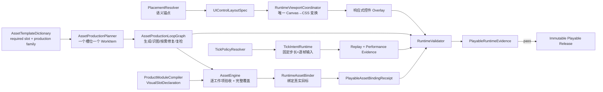

# 可玩运行时架构：资产生产、Viewport、资产绑定与 Tick

## 1. 结论

本设计解决四个同时暴露的基础问题：资产模板没有形成真实的闭环生产与完整槽位覆盖、触控控件不随实际画布适配、生成图片没有成为真实游戏对象的视觉、Tick 接入后以 20Hz 驱动单机物理导致严重卡顿。

上层机器真相源是 [`shared/playable-runtime-contract.json`](../shared/playable-runtime-contract.json)，资产生产循环的领域真相源是 [`shared/asset-production-pipeline-contract.json`](../shared/asset-production-pipeline-contract.json)。本文解释设计，不复制其他领域词典。Asset Engine 继续拥有像素与资产验收，Product Module System 继续拥有游戏对象和可视槽声明，Tick Runtime 继续拥有逐 tick 输入与回放；本契约只拥有它们在最终 release 中必须共同成立的集成事实。

这是一项跨 WP0、WP2、WP4、WP7 的 P0 硬门，不是 Golden-001 专属修复，也不是 ComfyUI provider 的职责。

## 2. 唯一运行时闭环

`RuntimeValidator` 不再以文件存在、PNG 存在、binding manifest 存在或语义伪运行作为可玩证明。只有真实 release 的 viewport、对象绑定、Tick 性能、回放和浏览器交互共同通过，才能进入 `playable`。

## 3. AssetProductionPipelineContract

`asset-template-dictionary.json` 只拥有模板身份、版本、slot、生产家族、recipe 引用和约束，不拥有 provider 工作流或动态 Revision。`AssetProductionPlanner` 负责把固定版本模板编译成唯一的 `AssetProductionSetPlan`，每个 required slot 对应一个 `AssetWorkItemPlan`，并显式映射 `targetVisualSlotId`。

每个工作项运行同一个条件循环：resolve/generate 后进行 Vision 与确定性检查；根据 typed defect 选择抠图、局部改图、上色或确定性归一化；任何像素变化都创建 child Revision 并强制重新检查。当前扁平卡通风格默认走最短路径，只有检测到相应问题才进入额外能力。

单张 PNG、provider receipt、某个工作项成功或 simulated-local 证据都不能生成 `AssetProductionSetAcceptanceReceipt`。只有全部 required 工作项分别 accepted、目标视觉槽覆盖完整并获得真实绑定后，新的 ProjectVersion 才能进入可玩验证。详细循环见 [`docs/comfyui-asset-production-pipeline.md`](comfyui-asset-production-pipeline.md)。

## 4. UIViewportContract

### 4.1 四种坐标空间

1. Logical Design Space：GDevelop 项目声明的逻辑分辨率，例如 800×600。
2. Canvas Content Space：保持宽高比缩放后真正显示游戏内容的矩形，不包含 letterbox。
3. CSS Space：浏览器布局和 PointerEvent 使用的 CSS 像素。
4. Device Space：DPR 后的物理像素，只影响渲染质量，不参与语义放置。

PlacementResolver 只输出 `UIControlLayoutSpec`：控件语义锚点、相对偏移、尺寸策略、安全区策略和重叠组。它不能输出 DOM `left/top`。`RuntimeViewportCoordinator` 从 GDJS 使用的同一 Canvas 读取内容矩形，并成为唯一坐标变换 owner。

所有控件必须放在一个与 Canvas Content Rect 完全重合的 overlay root 中。控件位置相对 safe content rect 计算，尺寸以短边比例计算并进行最小/最大 CSS 像素夹取。不得再把控件直接 append 到 `document.body` 后按 800×600 坐标定位。

### 4.2 更新与验收

Coordinator 在首次 attach、ResizeObserver、横竖屏变化、全屏变化和安全区变化时生成新的 `UIViewportSnapshot`。更新必须幂等，不能重复创建控件或监听器。

最低矩阵包括 320×568、390×844 竖屏，844×390、800×600、1280×720 横屏和 1024×768 平板。每个 case 必须证明：控件完整位于内容安全区、可视形状与点击区域一致、letterbox 不改变语义位置、横竖屏切换后仍可操作。

## 5. PlayableAssetBindingContract

### 5.1 两次验收不能混为一次

Asset Engine 的 Acceptance 证明“这是一张符合 AssetSpec 的有效资产”；它不能证明“玩家在游戏里看见的 Player 正在使用它”。后者由 RuntimeAssetBinder 负责，并产生独立的 `PlayableAssetBindingReceipt`。

Product Module Compiler 必须为 Player、Enemy、Collectible、Platform、Background、UI 等可视角色声明稳定的 `VisualSlotDeclaration`。AssetSpec 只能引用 `targetVisualSlotId`，不能继续使用自由文本 `bindingTarget` 猜目标。

### 5.2 合法绑定模式

- `object-resource`：把项目本地资源装到目标对象自身的 renderer。
- `attached-visual`：碰撞与行为仍由 gameplay object 拥有，渲染对象严格跟随其 transform；receipt 必须证明两者绑定。
- `layer-background`：只用于声明过的场景背景槽。
- `ui-slot`：只用于声明过的 UI 槽。

Player、Enemy、Collectible、Platform 等 world role 禁止使用 `ui-slot` 或自由悬浮 overlay。当前 `GameCastleAsset_*` 固定放 UI 左上角的方式必须删除。

### 5.3 生图质量门

生成请求至少声明角色、主体、轮廓、姿势、镜头、调色板、背景策略、边缘策略、目标尺寸和动画意图。Vision Review 必须验证语义角色、风格、构图、背景和边缘安全，不能只验证“是 PNG”。

required visual slot 必须同时通过资产验收和可玩绑定验收；否则阻塞 playable。optional slot 可以产生明确 placeholder debt，但不能被报告为 generated-and-bound success。

## 6. TickPolicyContract

### 6.1 时钟分层

- Simulation Clock：固定步长推进游戏逻辑、物理和事件。
- Input Clock：在每个 simulation tick 采样输入，形成编号 intent frame。
- Network Clock：发送输入、命令或 snapshot。
- Render Clock：由 requestAnimationFrame 驱动；当提交状态低于显示刷新率时使用真实前后状态插值。

单机和联机共享输入帧语义与 replay 格式，不共享低频网络默认值。

### 6.2 频率政策

- 单机交互：simulation 60Hz、input 60Hz、render rAF。
- Realtime lockstep：优先 60Hz；simulation、input、network 任一实时 cadence 最低 30Hz。
- Server authoritative：客户端预测 60Hz；authority simulation 优先 60Hz、最低30Hz；网络最低30Hz，并要求 snapshot 插值。
- 异步玩法：交互客户端仍为60Hz，网络事件驱动。

任何交互 release 不得默认20Hz。固定 tick 是为了确定性，不是为了降低视觉帧率。

### 6.3 回放与过载

每个 simulation tick 都写入 replay，包括空输入帧。receipt 至少包含输入、事件、状态哈希、快照和最终哈希。回放不经过 DOM，也不以毫秒 timer 作为真相。

每个渲染帧最多补跑5个 simulation tick；超过预算产生性能 debt，不允许静默把发布频率永久降到合同下限以下。

## 7. 联合验收

`PlayableRuntimeEvidence` 聚合六类报告：ViewportMatrix、AssetProduction、AssetBinding、TickPerformance、TickReplay、BrowserPlaytest。

Golden 必须在真实 HTTP origin 打开实际不可变 release，并证明：

1. 全部 required 资产工作项完成真实生成或复用、循环检查与独立验收；
2. resize/横竖屏后控件仍在正确位置且可点击；
3. 点击经过 tick frame 使真实 Player 状态变化；
4. 生成资产显示在声明目标对象上，不存在左上角悬浮副本；
5. 单机观测60Hz，联机策略不允许低于30Hz；
6. replay 的最终状态哈希与原始执行一致。

PNG、provider receipt、manifest 或 semantic playtest 只能成为子证据，不能单独让 Golden 通过。

## 8. 迁移与删除

本项目不保留兼容双轨。Terra 实现时必须删除或 fail closed：

- body-relative 固定像素控件定位；
- 自由文本 `bindingTarget` 作为运行时目标；
- world asset 的通用 UI overlay injector；
- 混合角色、平台、道具、背景和 UI 的父图生成与固定格 Prompt；
- 像素发生变化后复用旧 Review，或无父 Revision/receipt 的修改产物；
- 把 simulated-local 或单工作项成功当成完整生产集证据；
- 单机交互20Hz默认值；
- 对声明 Tick 输入的项目继续使用另一套标准 GDevelop loop；
- Golden 专用输入或资产绑定分支；
- 仅凭文件或伪 playtest 判定 playable 的门。

完整实现顺序和停止条件见 [`docs/playable-runtime-terra-handoff.md`](playable-runtime-terra-handoff.md)。
