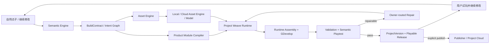

# GameCastle 完整项目实现架构

## 目标

完整项目的唯一完成契约是 `shared/project-completion-contract.json`。它不取代语义引擎、资产引擎、
云资产引擎、模板词典或 Provider Governance，而是规定这些已完成领域如何被编排成一个用户产品。

GameCastle 的产品承诺不是“生成很多代码”，而是：玩家说出一个点子，系统尽快给出第一个可玩版本；
玩家继续用自然语言修改同一个项目，最终得到可验证、可回滚、可分享的版本。手绘、上传、模板选择
都是可选加速器，不能成为创建前置表单。

## 总闭环

Project Weave 只拥有编排、checkpoint、状态转换和 owner route；它不能复制领域算法。语义理解仍由
Semantic Engine 决定，像素与资产选择仍由 Asset Engine 决定，公共资源事实仍由 CloudAssetEngine
决定，玩法展开仍由 ProductModuleCompiler 决定，项目文件和发布物分别由 ProjectStore 与 Publisher
决定。

## 四级完成定义

| 里程碑 | 用户获得什么 | 必需工作包 |
| --- | --- | --- |
| Local Creator Complete | 一句话创建、试玩、继续修改、回滚本地项目 | WP0–WP4 |
| Shareable Product Complete | 项目同步、不可变发布、分享与撤回 | WP5–WP6 |
| Multiplayer Product Complete | 受支持模板可建房、联机、断线恢复 | WP7 |
| Operable Product Complete | 安全、监控、成本、迁移和运维可控 | WP8 |

后续沟通必须指明目标里程碑，不能再用一个“完成度百分比”混合本地创造器和线上运营产品。

## 主路径优先级

1. WP0 把所有 project owner 接入同一条真实 Project Weave LangGraph。
2. WP1 已提供统一 ProviderRuntime；当前以 simulated provider 完整验证 Port、预算、取消、receipt 与失败路由。真实 Provider 只替换同一 Port，缺少凭据不会阻断本地创造路径。
3. WP3 已将 ProjectWeave 成功 run 提交为多项目隔离的不可变本地 ProjectVersion，支持 continue、restart recovery 与 rollback。
4. WP2 提供足够的轻量玩法模块和模板，使多数点子无需临时生成玩法代码。
5. WP4 已把已有引擎与版本能力变成简单、连续的玩家体验；WP2 可并行扩大玩法覆盖，但不阻塞体验层。
5. WP5–WP6 再建立发布、账号和个人项目云；它们与公共资产云严格分离。
6. WP7 只为声明支持联机的模板启用多人运行时。
7. WP8 在所有线上能力上建立安全、成本和运维门。

## Project Weave 的真实完成门

WP0 已实现：`ai/project-weave-runtime.js` 是唯一正式 Project Weave LangGraph。所有项目节点均为
`wired-langgraph`，并在一次运行中读写真实 artifact、支持 checkpoint/resume、create/continue 和
owner-routed failure。`npm run check:project` 是其总门；旧 smoke 不能作为完成证据。

正式 ProjectRun 必须同时保留：

- ProjectWorld、AssetWorld 与各自 semantic hash；
- BuildContract、AssetManifest、Runtime/HTML manifests；
- ValidationReport、PlaytestReport 和 owner route；
- graph trace、checkpoint、成本/Provider receipts；
- 成功时的 immutable ProjectVersion，失败时的可恢复 debt。

## 简单体验与严格内部

用户界面只展示自然意图、当前阶段、可玩版本、版本历史和可行动问题。模块 ID、模板槽、GDJS、
坐标、Provider 参数、Bridge Plan、内部错误堆栈不能成为用户必填项。Runtime 在内部使用稳定契约、
词典和 owner route，把复杂性吸收掉，而不是把标准引擎流程转嫁给玩家。

## 与三个已完成引擎的关系

- Semantic Engine：拥有“用户想做什么”，输出闭合意图和 BuildContract。
- Asset Engine：拥有“当前项目用什么资源”，输出 AssetWorld 和 project-local binding。
- CloudAssetEngine：拥有“哪些公共资源可安全复用”，不保存个人项目。
- Project Completion：拥有“这些领域何时执行、如何恢复、何时成为可玩/可发布版本”。

新增能力必须进入相应 owner 的契约。禁止把剩余工作重新塞回语义 prompt、资产 resolver 或前端状态。
