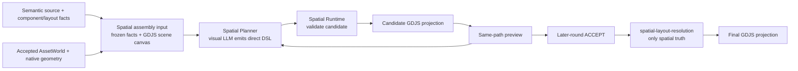

# Spatial Planner and Runtime

`shared/spatial-engine-contract.json` is the Spatial Engine contract. It keeps one spatial truth boundary while allowing a visual LLM to make the first layout decision.

The first assembly coordinate space is the selected GDJS scene canvas: project width and height, selected scene, layers, and camera size/viewport facts. It is a project fact, not a device profile or a separate screen input.

## Ownership

| Fact | Owner | Meaning |
| --- | --- | --- |
| Spatial intent | `GameSemanticSource` + semantic layout dictionary | Roles, legal regions, percentage safe areas, anchor preferences, overlap policy, layer/z-order bounds, and reservation. No resolved coordinates. |
| Component facts | Source component instances + `semantic-component-expansion` | Component purpose, config, bindings, and generated semantic members/entities/layouts/events. |
| Resource acceptance | Asset Engine / `semantic-asset-world` | Accepted resources. Spatial planning does not rate, replace, or generate them. |
| Native geometry | canonical geometry-fact producer | Native size, drawable boundary, object origin, and pinned GDJS coordinate evidence. |
| First layout candidate | Spatial Planner visual LLM | Direct GDJS object-origin positions, display sizes, angle, and legal layer/z-order choices. |
| Final spatial truth | `spatial-layout-resolution` | The only accepted spatial result. |
| Projection, preview, trace | GDJS Spatial Adapter / Spatial Planner Trace | Derived execution and diagnostic evidence; none is another layout truth. |

## Flow



The graph is implemented in `ai/spatial-planner-langgraph.js`. Contract-declared nodes cover context, model invocation, candidate validation, GDJS candidate projection, preview, feedback, acceptance, and final projection.

## Planner input and output

The visual LLM receives one frozen, hash-bound semantic view: entity roles/state, asset descriptions, component config and expansion, interaction facts, layout relations, ordered accepted-image references, and exact GDJS scene/camera facts. Every round declares the complete provider image order with explicit `imageRef` values; after a candidate, the same list also names that candidate's GDJS-derived preview.

It returns only `spatial-dsl-v1`:

```text
PLACE subject=<json-string> x=<number> y=<number> width=<number> height=<number> angle=<number> layer=<json-string> zOrder=<number>
ACCEPT
```

A PLACE program contains every scene-instance subject. `ACCEPT` is a standalone later-round response for an already projected and previewed candidate.

## External-round trace

`onSpatialRound(entry)` exposes each raw DSL response immediately. The same response is immediately persisted under the run trace directory. A completed round records its prompt, ordered image inputs, DSL, parse/validation outcome, projection, preview, execution result, and feedback. A provider-failed round still persists its exact prompt, image order, and failure fact. `run.json` indexes the full run.

These files exist for diagnosis and later training provenance. They are evidence only; Runtime never reads them as layout truth.

## Runtime guarantees

`runtime/spatial/` never generates the first draft. It validates:

- source, dictionary, component expansion, AssetWorld, asset-bound project, and assembly-input identity;
- declared subjects, GDJS object names, object origins, native drawable bounds, display sizes, layers, and camera facts;
- semantic reservations, safe-area percentages or grid scope, declared layers, z-order ranges, and reject-overlap groups;
- the actual candidate projection and preview documents supplied to a later acceptance round.

Dictionary anchor preferences guide the visual model. Runtime does not turn those preferences into exact coordinates, so the model remains the layout authority while hard legality remains deterministic.

`sceneCanvas.layers[].cameras[]` preserves GDJS camera size and normalized viewport facts. This version supports one default-size, default-viewport camera per layer. Custom or multi-camera framing fails before model invocation; device adaptation is outside this version.

After ACCEPT, Runtime creates `spatial-layout-resolution`; `createAcceptedProjection` materializes final GDJS instances from that single coordinate truth only after revalidating the exact candidate, candidate projection, and preview evidence bound by the resolution.

## Outside this version

- Asset quality, format, and acceptance remain Asset Engine work.
- Device adaptation remains later GDJS runtime behavior.
- Training and distillation may replace the Planner model port later; they do not change the contracts or Runtime validator.

`ai/spatial-product-pipeline.js#run` is the bridge from an accepted `semantic-asset-product` into this flow. It requires component-expansion evidence, geometry facts, a preview directory, an explicit round budget, and either Provider Runtime or an injected planner port.

The production role is `spatial-plan`. Configure `SPATIAL_MODEL_PROVIDER`, `SPATIAL_VISION_MODEL`, `SPATIAL_MODEL_MAX_COST`, and `SPATIAL_ALLOW_EXTERNAL` for a vision-capable provider. A text-only provider fails at the modality boundary.
